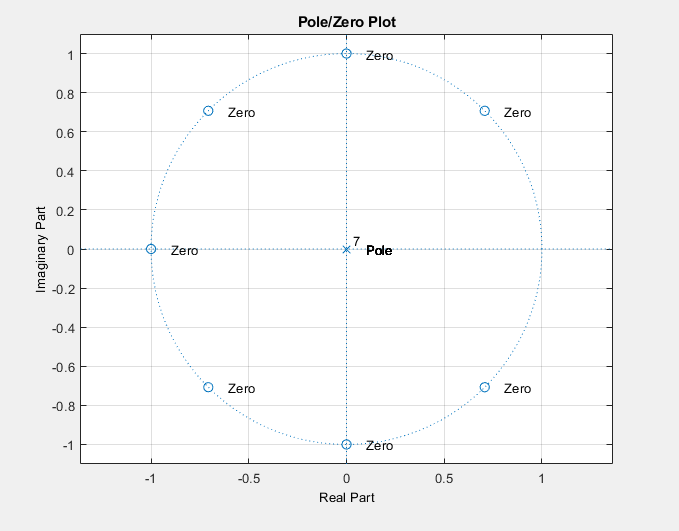

# **Digital Signal Processing Lab - 1**

<div style="text-align: right" font size= "4"> 13th January 2020 </div>

In this lab session we will work with some primitive FIR filters namely:
* Moving Average Filter
* First order difference filter
* Three point central difference filter

We will also look at an example where we will use a combination of these filters for a particular signal processing task. The link to the lab tasks can be found [here](./code/lab.pdf)

----
 ## **Moving Average Filter**

 ***Time Domain Analysis***

The time domain equation of a moving average filter is defined as

&nbsp;&nbsp;&nbsp;&nbsp;&nbsp;&nbsp;&nbsp;&nbsp;&nbsp;&nbsp;&nbsp;&nbsp;&nbsp;&nbsp;&nbsp;&nbsp;&nbsp;&nbsp;&nbsp;&nbsp;&nbsp;&nbsp;&nbsp;&nbsp;&nbsp;&nbsp;&nbsp;&nbsp;&nbsp;&nbsp;&nbsp;&nbsp;&nbsp;&nbsp;&nbsp;&nbsp;&nbsp;&nbsp;&nbsp;&nbsp;&nbsp;&nbsp;&nbsp;&nbsp;&nbsp;&nbsp;&nbsp;&nbsp;&nbsp;&nbsp;&nbsp;&nbsp;&nbsp;&nbsp;&nbsp;&nbsp;&nbsp;&nbsp;&nbsp;&nbsp;


This filter gives the current output as the average of previous *m* inputs. All digital systems can be analyzed using a the Z-transform such that input and output characteristics of the system can be known. To find the transfer function *H(z)* we will divide the response *Y(z)* by input *X(z)*. 

&nbsp;&nbsp;&nbsp;&nbsp;&nbsp;&nbsp;&nbsp;&nbsp;&nbsp;&nbsp;&nbsp;&nbsp;&nbsp;&nbsp;&nbsp;&nbsp;&nbsp;&nbsp;&nbsp;&nbsp;&nbsp;&nbsp;&nbsp;&nbsp;&nbsp;&nbsp;&nbsp;&nbsp;&nbsp;&nbsp;


If we take *L=8* and proceed further then

&nbsp;&nbsp;&nbsp;&nbsp;&nbsp;&nbsp;&nbsp;&nbsp;&nbsp;&nbsp;&nbsp;&nbsp;&nbsp;&nbsp;&nbsp;&nbsp;&nbsp;&nbsp;&nbsp;&nbsp;&nbsp;&nbsp;&nbsp;&nbsp;&nbsp;&nbsp;&nbsp;&nbsp;&nbsp;&nbsp;&nbsp;&nbsp;&nbsp;&nbsp;&nbsp;&nbsp;&nbsp;&nbsp;&nbsp;&nbsp;&nbsp;&nbsp;&nbsp;&nbsp;&nbsp;&nbsp;&nbsp;&nbsp;&nbsp;&nbsp;&nbsp;&nbsp;&nbsp;&nbsp;&nbsp;&nbsp;&nbsp;&nbsp;&nbsp;&nbsp;


with 

&nbsp;&nbsp;&nbsp;&nbsp;&nbsp;&nbsp;&nbsp;&nbsp;&nbsp;&nbsp;&nbsp;&nbsp;&nbsp;&nbsp;&nbsp;


&nbsp;&nbsp;&nbsp;&nbsp;&nbsp;&nbsp;&nbsp;&nbsp;&nbsp;&nbsp;&nbsp;&nbsp;&nbsp;&nbsp;&nbsp;&nbsp;&nbsp;&nbsp;&nbsp;&nbsp;&nbsp;&nbsp;&nbsp;&nbsp;&nbsp;&nbsp;&nbsp;&nbsp;&nbsp;&nbsp;&nbsp;&nbsp;&nbsp;&nbsp;&nbsp;&nbsp;&nbsp;&nbsp;&nbsp;&nbsp;&nbsp;&nbsp;&nbsp;&nbsp;&nbsp;&nbsp;&nbsp;&nbsp;


***Frequency Domain Analysis***

Once we have this transfer function in z domain we can get the frequency domain representation by replacing *z* by *e<sup>jw* and thus we can find the magnitude and phase response.

&nbsp;&nbsp;&nbsp;&nbsp;&nbsp;&nbsp;&nbsp;&nbsp;&nbsp;&nbsp;&nbsp;&nbsp;&nbsp;&nbsp;&nbsp;&nbsp;&nbsp;&nbsp;&nbsp;&nbsp;&nbsp;&nbsp;&nbsp;&nbsp;&nbsp;&nbsp;&nbsp;&nbsp;&nbsp;&nbsp;
<p float="left">

&nbsp;&nbsp;&nbsp;&nbsp;&nbsp;&nbsp;

</p>


We can also plot the above functions in MATLAB which reveals that the Moving Average filter is essentially a **Low Pass Filter**. Thus it can be used to remove high frequency components from a given signal. 

&nbsp;&nbsp;&nbsp;&nbsp;&nbsp;&nbsp;&nbsp;&nbsp;&nbsp;&nbsp;&nbsp;&nbsp;&nbsp;&nbsp;&nbsp;&nbsp;&nbsp;&nbsp;&nbsp;&nbsp;&nbsp;&nbsp;&nbsp;&nbsp;&nbsp;&nbsp;&nbsp;&nbsp;&nbsp;&nbsp;
<p float="left">


</p>

The MATLAB script for generating the above plots of pole-zero, magnitude and phase responses can be loacated [here](code/maf.m).

***Implementation on Arduino Due Board***

The crux of the implementation is shown below. For actual runnable script, please go [here](code/maf.ino)


```cpp

// int x[1000];
// The input array x is not shown here. Please look at the code file.
void setup() {
  // put your setup code here, to run once:
  Serial.begin(9600);
}

void loop() {
  // put your main code here, to run repeatedly:

  // Moving average filter with number of samples as 'm'
  int y[1000];
  int m = 800;
  y[0] = x[0];
  for(int i=1; i<m; i++){
    y[i]= y[i-1] + x[i];
  }
  for(int i=m; i<1000; i++){
    y[i] = 0;
    for(int j=0; j<m; j++){
      y[i] += x[i-j];
    }
  }

  for(int i=0; i<1000; i++){
    y[i] = y[i]/m;
  }
  
  for(int i=0; i<1000; i++){
    Serial.print(x[i]);
    Serial.print(',');
    Serial.println(y[i]);

  }
  
}
```

Some results are shown below when moving average filter with different values of ***L*** is applied to a PPG signal.

In  all the images below <i style="color:blue">blue </i> indicates the **input signal** and <i style="color:red">red </i> indicates the output of **Moving Average Filter**.

<figure>
  
  <figcaption><b>Moving Average Filter with L=8</b></figcaption>
</figure>

<figure>
  
  <figcaption><b>Moving Average Filter with L=80</b></figcaption>
</figure>

<figure>
  
  <figcaption><b>Moving Average Filter with L=800. The low frequency baseline can be extracted as shown</b></figcaption>
</figure>

<br>
<br>

***Conclusions***

As we can see the Moving Average Filter acts as a good low pass filter removing the high frequency noise from the signal. As the window size increases the cutoff frequency of the filter also comes down therefore more smoothing takes place.

---- 

 ## **First Order Difference Filter**

 ***Time Domain Analysis***

 The time domain equation of the first order difference filter is as follows

&nbsp;&nbsp;&nbsp;&nbsp;&nbsp;&nbsp;&nbsp;&nbsp;&nbsp;&nbsp;&nbsp;&nbsp;&nbsp;&nbsp;&nbsp;&nbsp;&nbsp;&nbsp;&nbsp;&nbsp;&nbsp;&nbsp;&nbsp;&nbsp;&nbsp;&nbsp;&nbsp;&nbsp;&nbsp;&nbsp;&nbsp;&nbsp;&nbsp;&nbsp;&nbsp;&nbsp;&nbsp;&nbsp;&nbsp;&nbsp;&nbsp;&nbsp;&nbsp;&nbsp;&nbsp;&nbsp;&nbsp;&nbsp;&nbsp;&nbsp;&nbsp;&nbsp;&nbsp;&nbsp;&nbsp;&nbsp;&nbsp;&nbsp;&nbsp;&nbsp;


This filter gives the current output as the difference of current and previous inputs. All digital systems can be analyzed using a the Z-transform such that input and output characteristics of the system can be known. To find the transfer function *H(z)* we will divide the response *Y(z)* by input *X(z)*. 

&nbsp;&nbsp;&nbsp;&nbsp;&nbsp;&nbsp;&nbsp;&nbsp;&nbsp;&nbsp;&nbsp;&nbsp;&nbsp;&nbsp;&nbsp;&nbsp;&nbsp;&nbsp;&nbsp;&nbsp;&nbsp;&nbsp;&nbsp;&nbsp;&nbsp;&nbsp;&nbsp;&nbsp;&nbsp;&nbsp;


with 

&nbsp;&nbsp;&nbsp;&nbsp;&nbsp;&nbsp;&nbsp;&nbsp;&nbsp;&nbsp;&nbsp;&nbsp;&nbsp;&nbsp;&nbsp;&nbsp;&nbsp;&nbsp;&nbsp;&nbsp;&nbsp;&nbsp;&nbsp;&nbsp;&nbsp;&nbsp;&nbsp;&nbsp;


&nbsp;&nbsp;&nbsp;&nbsp;&nbsp;&nbsp;&nbsp;&nbsp;&nbsp;&nbsp;&nbsp;&nbsp;&nbsp;&nbsp;&nbsp;&nbsp;&nbsp;&nbsp;&nbsp;&nbsp;&nbsp;&nbsp;&nbsp;&nbsp;&nbsp;&nbsp;&nbsp;&nbsp;&nbsp;&nbsp;&nbsp;&nbsp;&nbsp;&nbsp;&nbsp;&nbsp;&nbsp;&nbsp;&nbsp;&nbsp;&nbsp;&nbsp;&nbsp;&nbsp;&nbsp;&nbsp;&nbsp;&nbsp;


***Frequency Domain Analysis***

Once we have this transfer function in z domain we can get the frequency domain representation by replacing *z* by *e<sup>jw* and thus we can find the magnitude and phase response.

&nbsp;&nbsp;&nbsp;&nbsp;&nbsp;&nbsp;&nbsp;&nbsp;&nbsp;&nbsp;&nbsp;&nbsp;&nbsp;&nbsp;&nbsp;&nbsp;&nbsp;&nbsp;&nbsp;&nbsp;&nbsp;&nbsp;&nbsp;&nbsp;&nbsp;&nbsp;&nbsp;&nbsp;&nbsp;&nbsp;


We can also plot the above functions in MATLAB which reveals that the First Order Difference Filter is essentially a **High Pass Filter**. Thus it can be used to remove low frequency components from a given signal. 

&nbsp;&nbsp;&nbsp;&nbsp;&nbsp;&nbsp;&nbsp;&nbsp;&nbsp;&nbsp;&nbsp;&nbsp;&nbsp;&nbsp;&nbsp;&nbsp;&nbsp;&nbsp;&nbsp;&nbsp;&nbsp;&nbsp;&nbsp;&nbsp;&nbsp;&nbsp;&nbsp;&nbsp;&nbsp;&nbsp;
<p float="left">

&nbsp;&nbsp;&nbsp;&nbsp;&nbsp;&nbsp;

</p>

The MATLAB script for generating the above plots of pole-zero, magnitude and phase responses can be loacated [here](code/firstorder.m).

***Implementation on Arduino Due Board***

The crux of the implementation is shown below. For actual runnable script, please go [here](code/firstorder.ino)


```cpp

int x[1000];
// The input array x is not shown here. Please look at the code file.

void setup() {
  // put your setup code here, to run once:
  Serial.begin(9600);
}

void loop() {
  // put your main code here, to run repeatedly:
  // First order difference
  int z[1000];
  z[0] = 0;
  for(int i=1; i<1000; i++){
    z[i] = x[i] -  x[i-1];
  }

  for(int i=0; i<1000; i++){
    Serial.print(x[i]);
    Serial.print(',');
    Serial.println(z[i]+10);

  }
  
}
 ```

 The result after applying the first order difference filter on a PPG signal are shown below.

In the image below <i style="color:blue">blue </i> indicates the **input signal** and <i style="color:red">red </i> indicates the output of **First Order Difference Filter**.

<figure>
  
  <figcaption><b>First Order Difference Filter</b></figcaption>
</figure>


***Conclusions***

As we can see the First Order Difference Filter acts as a good high pass filter enhancing the high frequency components of the signal. Such filters can be used to highlights the peaks in the PPG signals as there are sudden transitions at peaks.

---- 

 ## **Three Point Central Difference Filter**

 ***Time Domain Analysis***

 The time domain equation of the three point central difference filter is as follows

&nbsp;&nbsp;&nbsp;&nbsp;&nbsp;&nbsp;&nbsp;&nbsp;&nbsp;&nbsp;&nbsp;&nbsp;&nbsp;&nbsp;&nbsp;&nbsp;&nbsp;&nbsp;&nbsp;&nbsp;&nbsp;&nbsp;&nbsp;&nbsp;&nbsp;&nbsp;&nbsp;&nbsp;&nbsp;&nbsp;&nbsp;&nbsp;&nbsp;&nbsp;&nbsp;&nbsp;&nbsp;&nbsp;&nbsp;&nbsp;&nbsp;&nbsp;&nbsp;&nbsp;&nbsp;&nbsp;&nbsp;&nbsp;&nbsp;&nbsp;&nbsp;&nbsp;&nbsp;&nbsp;&nbsp;&nbsp;&nbsp;&nbsp;&nbsp;&nbsp;


This filter gives the current output as the difference of current input and value two timesteps behind. All digital systems can be analyzed using a the Z-transform such that input and output characteristics of the system can be known. To find the transfer function *H(z)* we will divide the response *Y(z)* by input *X(z)*. 

&nbsp;&nbsp;&nbsp;&nbsp;&nbsp;&nbsp;&nbsp;&nbsp;&nbsp;&nbsp;&nbsp;&nbsp;&nbsp;&nbsp;&nbsp;&nbsp;&nbsp;&nbsp;&nbsp;&nbsp;&nbsp;&nbsp;&nbsp;&nbsp;&nbsp;&nbsp;&nbsp;&nbsp;&nbsp;&nbsp;


with 

&nbsp;&nbsp;&nbsp;&nbsp;&nbsp;&nbsp;&nbsp;&nbsp;&nbsp;&nbsp;&nbsp;&nbsp;&nbsp;&nbsp;&nbsp;&nbsp;&nbsp;&nbsp;&nbsp;&nbsp;&nbsp;&nbsp;&nbsp;&nbsp;&nbsp;&nbsp;&nbsp;&nbsp;&nbsp;&nbsp;
<p float="left">
&nbsp;&nbsp;&nbsp;&nbsp;&nbsp;

</p>

&nbsp;&nbsp;&nbsp;&nbsp;&nbsp;&nbsp;&nbsp;&nbsp;&nbsp;&nbsp;&nbsp;&nbsp;&nbsp;&nbsp;&nbsp;&nbsp;&nbsp;&nbsp;&nbsp;&nbsp;&nbsp;&nbsp;&nbsp;&nbsp;&nbsp;&nbsp;&nbsp;&nbsp;&nbsp;&nbsp;&nbsp;&nbsp;&nbsp;&nbsp;&nbsp;&nbsp;&nbsp;&nbsp;&nbsp;&nbsp;&nbsp;&nbsp;&nbsp;&nbsp;&nbsp;&nbsp;&nbsp;&nbsp;


***Frequency Domain Analysis***

Once we have this transfer function in z domain we can get the frequency domain representation by replacing *z* by *e<sup>jw* and thus we can find the magnitude and phase response.

&nbsp;&nbsp;&nbsp;&nbsp;&nbsp;&nbsp;&nbsp;&nbsp;&nbsp;&nbsp;&nbsp;&nbsp;&nbsp;&nbsp;&nbsp;&nbsp;&nbsp;&nbsp;&nbsp;&nbsp;&nbsp;&nbsp;&nbsp;&nbsp;&nbsp;&nbsp;&nbsp;&nbsp;&nbsp;&nbsp;
<p float="left">

&nbsp;&nbsp;&nbsp;&nbsp;&nbsp;&nbsp;

</p>


We can also plot the above functions in MATLAB which reveals that the Three Point Central Difference Filter is essentially a **Band Pass Filter**. Thus it will only allow a particular set of frequencies to pass through stopping the other very high frequency noise. 

&nbsp;&nbsp;&nbsp;&nbsp;&nbsp;&nbsp;&nbsp;&nbsp;&nbsp;&nbsp;&nbsp;&nbsp;&nbsp;&nbsp;&nbsp;&nbsp;&nbsp;&nbsp;&nbsp;&nbsp;&nbsp;&nbsp;&nbsp;&nbsp;&nbsp;&nbsp;&nbsp;&nbsp;&nbsp;&nbsp;
<p float="left">

<!-- &nbsp;&nbsp;&nbsp;&nbsp;&nbsp;&nbsp; -->

</p>

The MATLAB script for generating the above plots of pole-zero, magnitude and phase responses can be loacated [here](code/secondorder.m).

***Implementation on Arduino Due Board***

The crux of the implementation is shown below. For actual runnable script, please go [here](code/secondorder.ino)


```cpp
int x[1000];
// The input array x is not shown here. Please look at the code file.

void setup() {
  // put your setup code here, to run once:
  Serial.begin(9600);
}

void loop() {
  // put your main code here, to run repeatedly:

  // Second order difference
  int w[1000];
  w[0] = 0;
  w[1] = 0;
  for(int i=2; i<1000; i++){
    w[i] = x[i] -  x[i-2];
  }
  
  for(int i=0; i<1000; i++){
    Serial.print(x[i]);
    Serial.print(',');
    Serial.println(w[i]+10);
  }
  
}
 ```

 The result after applying the three point central difference filter on a PPG signal are shown below.

<p>In the image below <i style="color:blue">blue </i> indicates the <b>input signal</b> and <i style="color:red">red </i> indicates the output of <b>Three Point Central Difference Filter</b>.</p>


<figure>
  
  <figcaption><b>Three Point Central Difference Filter</b></figcaption>
</figure>


***Conclusions***

As we can see the Three Point Central Difference Filter acts as a band pass filter enhancing the frequency components of the signal in a particular band. Such filters can be used to highlights the high frequency components in the PPG signals after removing the low frequency components and very high frequency noise.

---- 

 ## **Question 4 (see [lab.pdf](code/lab.pdf))**

Here we have to first do a first order difference filtering followed by a moving average filter to smooth out the noises. The code for this is written below. We have used ***L=8*** for the moving average filter. See [here](code/ques4.ino) for the actual script.

```cpp
int x[1000];
// The input array x is not shown here. Please look at the code file.

void setup() {
  // put your setup code here, to run once:
  Serial.begin(9600);
}

void loop() {
  // put your main code here, to run repeatedly:

  // First order difference
  int z[1000];
  z[0] = 0;
  for(int i=1; i<1000; i++){
    z[i] = x[i] -  x[i-1];
  }


  // Moving average filter with number of samples as 'm'
  int y[1000];
  int m = 8;
  y[0] = z[0];
  for(int i=1; i<m; i++){
    y[i]= y[i-1] + z[i];
  }
  for(int i=m; i<1000; i++){
    y[i] = 0;
    for(int j=0; j<m; j++){
      y[i] += z[i-j];
    }
  }

  for(int i=0; i<1000; i++){
    y[i] = y[i]/m;
  }
  
  for(int i=0; i<1000; i++){
    Serial.print(x[i]);
    Serial.print(',');
    Serial.println(y[i]);

  }
  
}
```

The results obtained are shown below:

<p>In the images below <i style="color:blue">blue </i> indicates the <b>input signal</b> and <i style="color:red">red </i> indicates the output of the <b>Sequential Filtering</b>.</p>

&nbsp;&nbsp;&nbsp;&nbsp;&nbsp;&nbsp;&nbsp;&nbsp;&nbsp;&nbsp;&nbsp;&nbsp;&nbsp;&nbsp;&nbsp;&nbsp;&nbsp;&nbsp;&nbsp;&nbsp;&nbsp;&nbsp;&nbsp;&nbsp;&nbsp;&nbsp;&nbsp;&nbsp;&nbsp;&nbsp;
 <figure>
  
  <figcaption><b>First Order Difference followed by Moving Average Filtering</b></figcaption>
</figure>


***Conclusions***

Here, we can clearly see that by using a set of filters one after the other we can much better results than using the filters alone. In the above case, effective peak detection has been done using a first order difference and moving average filter. The first order first removes the very low frequency components and highlights the high frequency components namely the peaks and noise. Afterwards, the moving average filter removes the high frequency noise and smoothes out the waveform so that only peaks remain.

---- 
----