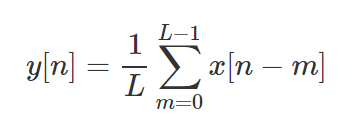
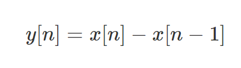
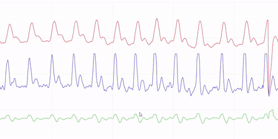
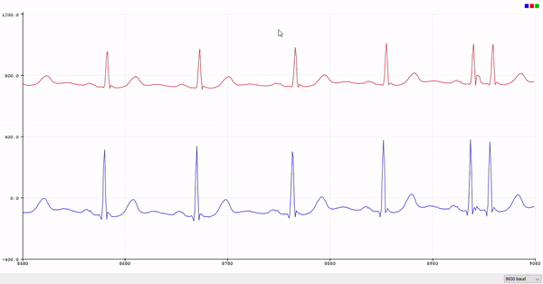
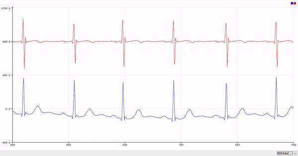
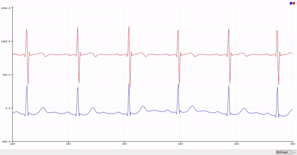
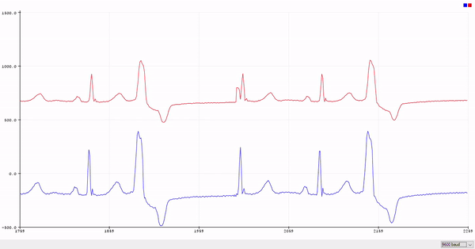
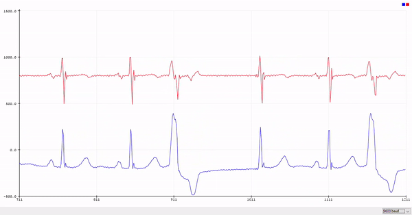
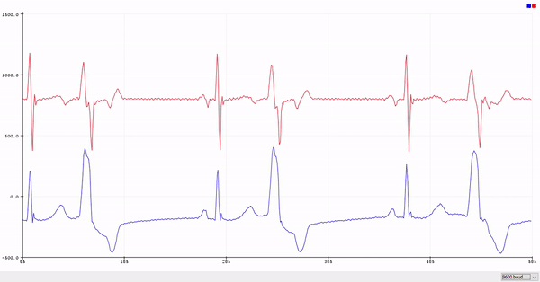

# Digital Signal Processing Lab - 2

20th January 2020

In this lab we will be using a PPG sensor and interface it with Arduino to directly record a live PPG signals are perform the operations and filter studied in [Lab - 1]((https://github.com/vatch123/DSPLAB-1)).

---

## Setting Up

We have interfaced the PPG sensor at the A0 analog pin of the Arduino board and we will use a sampling frequency of 100 Hz i.e. the time differebce between successive samples is 0.01 seconds.

***PPG Sensor***

A PPG or **photoplethysmogram** is an optically obtained plot which detects changes in the blood volume near the surface of the skin. It works by illuminating the skin using a LED and measuring the change in light intensity recieved after passing through the skin. The change in light intensity is measured by a photodiode. Thus when blood volume increases at each pulse it can accurately detect the pulses.

Here, we have performed the same set of operations on a live *PPG data* as we did in [Lab 1](https://github.com/vatch123/DSPLAB-1) namely the 
* **Moving Average Filter** \
  
* **First Order Difference Filter** \
  

* **Three Point Central Difference Filter** \
  

----

## The Code

```cpp
// Declaring the input pin where the sensor is connected
int analogPin=A0;

void setup() {
  // put your setup code here, to run once:
  Serial.begin(9600);
}

void loop() {
  // put your main code here, to run repeatedly:

  // Declaring the arrays of input, moving average and difference filters 
  float x[500],y[500],z[500];

  // Window size for moving average
  int L=8;

  // Running for all 500 samples
  for(int i=0; i<500; i++){

    // Reading the sensor
    x[i] = analogRead(analogPin);
    delay(10);

    // Moving Average and Difference
    y[i]=0;
    for(int j=0;j<L;j++)
    {
      if(i-j>=0)
        y[i]+=x[i-j];
    }
    if(i==0 || i==1)
      z[i]=0;
    
    // Here we are subtracting the sample which is two time stamps behind for three point
    // central difference but for the first order difference filter we will only subtract
    // the previous sample. 
    else
      z[i]=y[i]-y[i-2];

    // Showing all the signals 
    Serial.print(x[i]);
    Serial.print(",");
    Serial.print((y[i]/L)+500);
    Serial.print(",");
    Serial.println((z[i]/L)+300);
  }
  
}
```

## Outputs

<b>First Order Difference followed by Moving Average Filtering</b>




In the above image the blue colour indicates the input PPG signal, the red is the moving average filter with window size 8 applied to the input and finally the green one is first order difference filter applied to the moving average filter.


<b>Three Point Central Difference followed by Moving Average Filtering</b>


In the above image the blue colour indicates the input PPG signal, the red is the moving average filter with window size 8 applied to the input and finally the green one is three point central differnce filter applied to the moving average filter.

---

## Supplementary Tasks

As a continuation of our previous lab work ([Lab 1](https://github.com/vatch123/DSPLAB-1)), we need to perform the same set of operations on a freshly collected Electrocardiogram (ECG) data. The data is present [here.](/data) 

ECG is a graph of voltage vs time of electrical intensity of the heart using electrodes which is placed under the skin. Conventionally, a 12-lead ECG is used having ten electrodes placed on the chest and under the limbs. This captures the overall magnitude of the heart's electrical potential from 12 different directions.

We had collected two different ECG signals - ECG103, ECG119. The output plots for both of them are shown below.

* ***ECG103***

| Moving Average Filter| First Order Difference Filter| Three Point Central Difference Filter|
| ------------- |:-------------:| -----:|
|   | |  |

<br>
<br>

* ***ECG119***

| Moving Average Filter| First Order Difference Filter| Three Point Central Difference Filter|
| ------------- |:-------------:| -----:|
|   | |  |


* ***Key Points***

  * For both the ECG signals, the window size of the **MA filter** used was *4*. For winndow sizes larger than these the signal was getting distorded as even the smaller peaks were being removed from the signal.
  * Both the first order and three point central difference filter highlight the high frequency portions essentially the *peaks*.

---

## Conclusions

In this experiment we interfaced a PPG sensor with Arduino to learn how to perform realtime analysis of the signals. Also, we learnt about ECG signals and basic preprocessings that can be performed on it.

---
---

