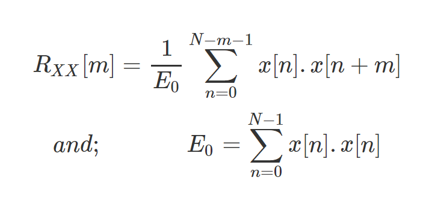
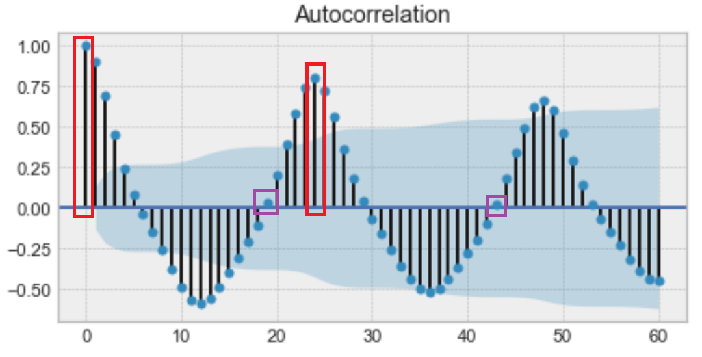
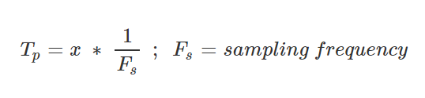
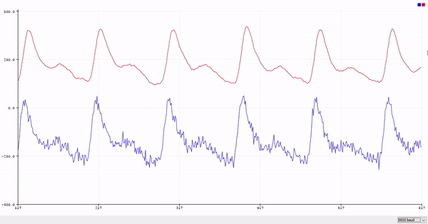
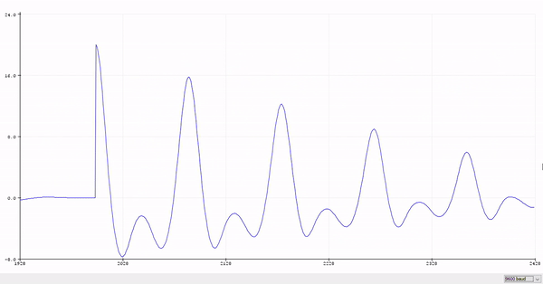
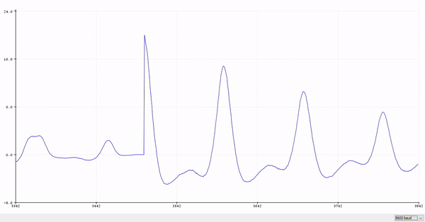
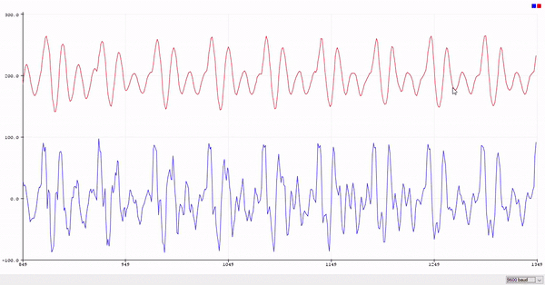
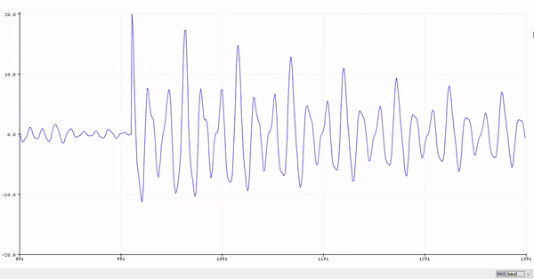

# Digital Signal Processing Lab - 3
27th January 2020

In this experiment we will try to estimate the pulse rate of a PPG signal along with the pitch frequency of a audio signal using autocorrelation.

### **What is Autocorrelation?**

Autocorrelation is a measure of similarity between a signal (*x[n]*) and its time delayed counterpart (*x[n+m]*).



We can use the autocorrelation function for calculating the frequency of the signals. The distance of the first maxima from the zeroth position gives the number of samples after which the signal is very similar to itself. Knowing, this we can approximate the time that is required for the signal to repeat itself and thus the frequency.


<figure>
  
  <figcaption><b>The boxes in red show the maxima at 0 and the first maxima after zeroth position</b><br>Pic credit - https://blog.faradars.org/wp-content/uploads/2019/02/autocorrelation-function.png</figcaption>
</figure>

Once we know the first maxima position, assuming it to be ***x*** then the time period is 



and frequency is reciprocal of **Time Period**.

----

### **Code**

All the codes of the lab work can be found [here](./code).

* **Autocorrelation of PPG signal**
```cpp
float x[2000] = {-148.6621707,-248.3187771,-267.1305467,-264.039437,-268.3502072,..
};

void setup() {
  // put your setup code here, to run once:
  Serial.begin(9600);
}

void loop() {
  // put your main code here, to run repeatedly:
  
  // Moving average filter with number of samples as 'm'
  int y[2000];
  int m = 20;
  y[0] = x[0];
  for(int i=1; i<m; i++){
    y[i]= y[i-1] + x[i];
  }
  for(int i=m; i<2000; i++){
    y[i] = 0;
    for(int j=0; j<m; j++){
      y[i] += x[i-j];
    }
  }

  // Mean subtraction
  float mean=0;
  for(int i=0; i<2000; i++){
    y[i] = y[i]/m;
    mean += y[i];
  }
  mean /= 2000;

  for(int i=0;i<2000;i++){
    y[i] -= mean;
  }

  // Block Processing
  float per[4];
  float pulse[4];
  for(int blocks=0; blocks<4; blocks++){
    per[blocks]=0;
    pulse[blocks]=0;
    float sig[500];
    float* corr;
    
    
    for(int i=0; i<500; i++){
      sig[i] = y[i+blocks*500];
    }
    
    corr = autocorr(sig, 500);

    int zero=0; float peak=0.0;
    for(int i=0; i<499; i++){
      if(corr[i]>=0 && corr[i+1]<0){
        zero = i;
        break;
      }
    }
    
    int lmax = zero;
    for(int k=zero; k<200; k++){
      if(corr[k]>peak){
        peak = corr[k];
        lmax = k;
      }
    }
    
    per[blocks] = lmax/100.0;
    pulse[blocks] = 60.0 / per[blocks];
    
    Serial.println(pulse[blocks]);
    
  }
  
}

float* autocorr(float* x, int m){
  float corr[m];
  float energy=0;
  for(int j=0; j<m;j++){
    energy += x[j]*x[j];
  }
  for(int delays=0; delays<m; delays++){
    corr[delays]=0;
    for(int i=0; i<m;i++){
      if(i>=delays)
        corr[delays] += x[i]*x[i-delays];
    }
    corr[delays] /= energy;
  }
  return corr;
}

```
To calculate the pulse rate here we need to multiply the frequency calculated with 60.
<br>

* **Autocorrelation of Audio signal**
```cpp
float x[4001] = {0.807525635,0.821929932,0.55090332,0.114776611,-0.299591064,...
};

void setup() {
  // put your setup code here, to run once:
  Serial.begin(9600);
}

void loop() {
  // put your main code here, to run repeatedly:

  // Moving average filter with number of samples as 'm'
  int y[4000];
  int m = 2;
  y[0] = x[0];
  for(int i=1; i<m; i++){
    y[i]= y[i-1] + x[i];
  }
  for(int i=m; i<4000; i++){
    y[i] = 0;
    for(int j=0; j<m; j++){
      y[i] += x[i-j];
    }
  }

  // Mean subtraction
  float mean=0;
  for(int i=0; i<4001; i++){
    y[i] = y[i]/m;
    mean += y[i];
  }
  mean /= 4001;

  for(int i=0;i<4001;i++){
    y[i] -= mean;
  }

  // Block Processing
  float per[4];
  float pulse[4];
  for(int blocks=0; blocks<4; blocks++){
    per[blocks]=0;
    pulse[blocks]=0;
    float sig[1000];
    float* corr;
    
    
    for(int i=0; i<1000; i++){
      sig[i] = y[i+blocks*1000];
    }
    
    corr = autocorr(sig, 1000);

    int zero=0; float peak=0.0;
    for(int i=0; i<999; i++){
      if(corr[i]>=0 && corr[i+1]<0){
        zero = i;
        break;
      }
    }
    
    int lmax = zero;
    for(int k=zero; k<300; k++){
      if(corr[k]>peak){
        peak = corr[k];
        lmax = k;
      }
    }
    
    per[blocks] = lmax/8000.0;
    pulse[blocks] = 1.0 / per[blocks];
    
   Serial.println(pulse[blocks]);
    
  }

}

float* autocorr(float* x, int m){
  float corr[m];
  float energy=0;
  for(int j=0; j<m;j++){
    energy += x[j]*x[j];
  }
  for(int delays=0; delays<m; delays++){
    corr[delays]=0;
    for(int i=0; i<m;i++){
      if(i>=delays)
        corr[delays] += x[i]*x[i-delays];
    }
    corr[delays] /= energy;
  }
  return corr;
}

```
----

### **Results**

* ***Plots for PPG***

| PPG and Moving Average Filter| Autocorrelation of filtered signal| Autocorrelation of unfiltered signal|
| ------------- |:-------------:| -----:|
|   | |  |


* ***Calculated pulse rate***

| Block Number | Filtered Pulse Rate | Unfiltered Pulse Rate | Error |
| ------------ | :------------------:| :--------------------:|:-----:|
| 1 | 67.42 | 66.67 | 1.11% |
| 2 | 68.18 | 68.18 | 0.0% |
| 3 | 65.93 | 65.93 | 0.0% |
| 4 | 61.22 | 61.22 | 0.0% |
| **Average** | **65.68** | **65.50** | **0.27%** |


* ***Plots for Speech signal***

| Speech and Moving Average Filter| Autocorrelation of filtered signal|
| ------------- |:-------------:| -----:|
|   | |


* ***Calculated frequency***

| Block Number | Filtered Frequency| 
| ------------ | :------------------:|
| 1 | 148.15 |
| 2 | 153.85 |
| 3 | 145.45 |
| 4 | 142.86 |
| **Average** | **147.58** |

----

### **Conclusions**

Through this experiment we understood the use of autocorrelation function and how it can be used to estimate frequency domain parameters.
