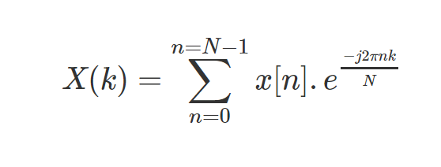
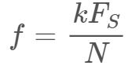
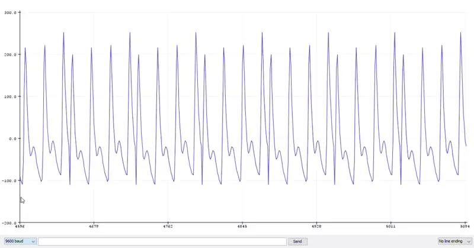
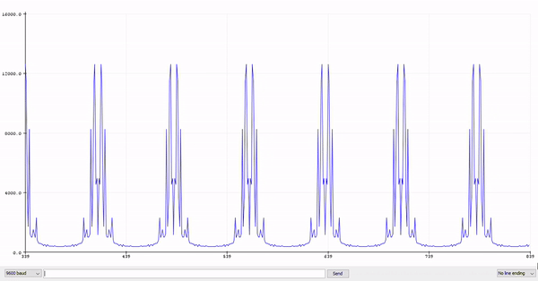
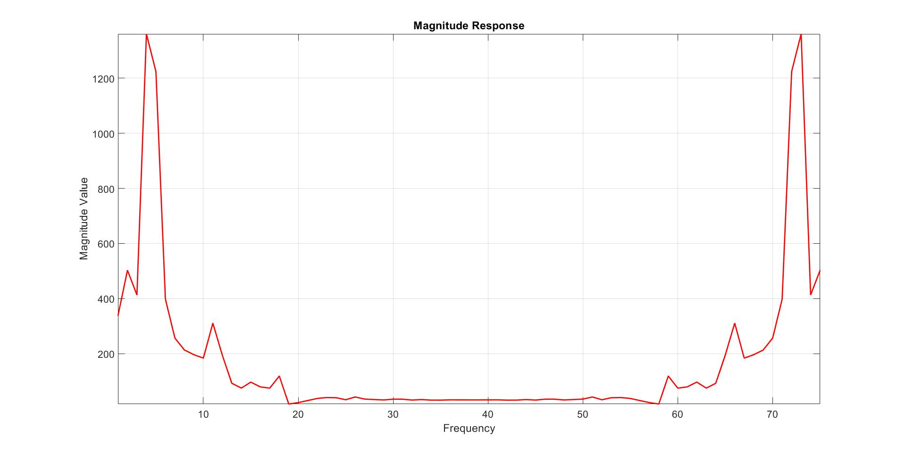
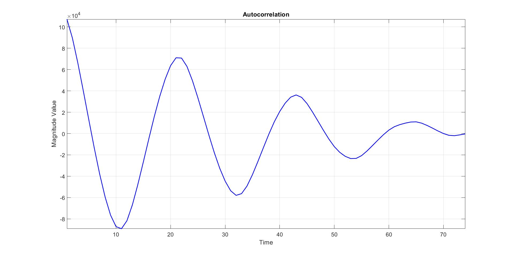

# Digital Signal Processing Lab - 4
3rd February 2020

In this experiment we will try to estimate the pulse rate of a PPG signal using Discrete Fourier Transform method and then compairing it the results obtained with the autocorrelation method.

### **What is DFT?**

Discrete Fourier Transform is a transform which enables us to evaluate the frequency domain parameters of a signal.

The DFT is defined as:



The DFT is obtained by taking a set a finite *N* values of the continuous Discrete Time Fourier Transform (DTFT). This is essential because a continuous function cannot be represented in a computer's memory so a set of finite samples have to be stored in the memory. Usually, these samples are seperated by a distance of 2*pi/N. Each sample value encodes the magnitude and phase of that frequency component.

### **Procedure**
* The PPG signal is smoothed using a Moving Average Filter to remove the high frequency noise.
* The N-point DFT of the signal is calculated using the above equation.
* The value of *k* for which the magnitude of DFT is maximum is recorded. This will correspond to the most dominant frequency component in the signal, which will actually be the component responsible for the pulses.
* The corresponding frequency for index *k* is




where *F<sub>s</sub>* is the sampling frequency and *N* is the number of samples in the signal.

Once we know the highest frequency component, we can find the pulse rate to be 60 times the frequency caculated above.

----

### **Code**

All the codes of the lab work can be found [here](./code).

* **DFT of PPG signal**
```cpp
float x[]={-87.17307638,-109.5495333,11.00037444,163.4286511,199.1497693,123.5660003,..
};

float  WR[75][75]={0},WI[75][75]={0};
#define pi 3.1415926535897932384626433832795


void setup() {
  // put your setup code here, to run once:
  Serial.begin(9600);


}

void loop() {
  // put your main code here, to run repeatedly:

  // Moving average filter with number of samples as 'm'
  int xt[75];
  int m = 2;
  xt[0] = x[0];
  for(int i=1; i<m; i++){
    xt[i]= xt[i-1] + x[i];
  }
  for(int i=m; i<75; i++){
    xt[i] = 0;
    for(int j=0; j<m; j++){
      xt[i] += x[i-j];
    }
  }

  for(int i=0; i<75; i++){
    xt[i] = xt[i]/m;
  }

// dealing with the reak and imaginary parts seperately
double xfr[75]={0},xfi[75]={0},mag[75]={0};
for(int i=0;i<75;i++)
  for(int j=0;j<75;j++)
    WR[i][j]=cos((2*pi*i*j)/75);


for(int i=0;i<75;i++)
  for(int j=0;j<75;j++)
    WI[i][j]=sin((2*pi*i*j)/75);

for(int i=0;i<75;i++)
{
for(int j=0;j<75;j++)
    xfr[i]+=xt[j]*WR[i][j];
}


for(int i=0;i<75;i++)
{
  for(int j=0;j<75;j++)
      xfi[i]+=xt[j]*WI[i][j];
}

for(int i=0;i<75;i++)
  mag[i]=sqrt(xfr[i]*xfr[i]+xfi[i]*xfi[i]);

// for(int i=0;i<75;i++)
//   Serial.println(mag[i]);

 m = 0;
 int peak =0;
 for(int k=0;k<5;k++){
  if(m < mag[k]){
    m = mag[k];
    peak = k;
  }
 }
 Serial.println(peak*20);
}

```

* **Autocorrelation of PPG signal**
```cpp
float x[]={-87.17307638,-109.5495333,11.00037444,163.4286511,199.1497693,123.5660003,..
};

void setup() {
  // put your setup code here, to run once:
  Serial.begin(9600);
}

void loop() {
  // put your main code here, to run repeatedly:
  
  // Moving average filter with number of samples as 'm'
  int y[75];
  int m = 4;
  y[0] = x[0];
  for(int i=1; i<m; i++){
    y[i]= y[i-1] + x[i];
  }
  for(int i=m; i<75; i++){
    y[i] = 0;
    for(int j=0; j<m; j++){
      y[i] += x[i-j];
    }
  }

  // Mean subtraction
  float mean=0;
  for(int i=0; i<75; i++){
    y[i] = y[i]/m;
    mean += y[i];
  }
  mean /= 75;

  for(int i=0;i<75;i++){
    y[i] -= mean;
  }

  // Block Processing
  float per[1];
  float pulse[1];
  for(int blocks=0; blocks<1; blocks++){
    per[blocks]=0;
    pulse[blocks]=0;
    float sig[75];
    float* corr;
    
    
    for(int i=0; i<75; i++){
      sig[i] = y[i+blocks*75];
    }
    
    corr = autocorr(sig, 75);

    int zero=0; float peak=0.0;
    for(int i=0; i<74; i++){
      if(corr[i]>=0 && corr[i+1]<0){
        zero = i;
        break;
      }
    }
    
    int lmax = zero;
    for(int k=zero; k<35; k++){
      if(corr[k]>peak){
        peak = corr[k];
        lmax = k;
      }
    }
    
    per[blocks] = lmax/25.0;
    pulse[blocks] = 60.0 / per[blocks];
    
//    Serial.println(pulse[blocks]);
    
  }
  Serial.println(pulse[0]);
  
}

float* autocorr(float* x, int m){
  float corr[m];
  float energy=0;
  for(int j=0; j<m;j++){
    energy += x[j]*x[j];
  }
  for(int delays=0; delays<m; delays++){
    corr[delays]=0;
    for(int i=0; i<m;i++){
      if(i>=delays)
        corr[delays] += x[i]*x[i-delays];
    }
    corr[delays] /= energy;
  }
  return corr;
}

```
----

### **Results**

* ***Plots for PPG***

| PPG Signal| DFT of filtered signal|
| ------------- |:-------------:|
|   | | 


I also wrote a MATLAB script doing the same set of operations that is pulse calculation using DFT and autocorrelation for validation purposes which can be found [here](./code). 

The magnitude response of the DFT of the signal as plotted in Matlab along with the autocorrelation are shown below: 

| PPG Signal| DFT of filtered signal|
| ------------- |:-------------:|
|   | | 


* ***Calculated pulse rate***

  | DFT on Arduino | DFT on Matlab | Autocorrelation on Arduino | Autocorrelation on Matlab |
  | ------------ | :------------------:| :--------------------:|:-----:|
  | 60 | 80 | 71.43 | 68.1818|

* ***Error***

  Assuming the results obtained through autocorrelation on Matlab to be correct, the errors of other methods are given below:

  | DFT on Arduino | DFT on Matlab | Autocorrelation on Arduino | Autocorrelation on Matlab |
  | ------------ | :------------------:| :--------------------:|:-----:|
  | 11.99% | 17.33% | 4.7% | -|

----

### **Conclusions**

Through this experiment we understood the applicabilty of the Discrete Time Fourier Transform and how it can be used to perform frequency domain analysis on a signal.
