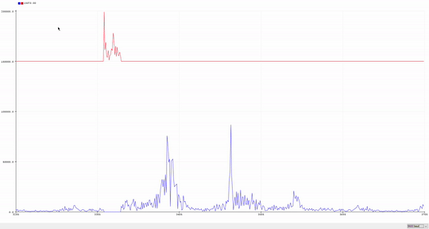

# Digital Signal Processing Lab - 5
10th February 2020

In this experiment we will try to estimate the respiratory rate by using Fast Fourier Transform method to seperate the respiratory signal embeddedd in the PPG signal.

### **What is FFT?**

Fast Fourier Transform is a transform which enables us to evaluate the frequency domain parameters of a signal. It is essentially a faster implementation of Discrete Fourier Transform using the "divide and conquer" paradigm to solve the overlapping subproblems. The DFT has a complexity of **O(N<sup>2</sup>)** whereas FFT has a complexity of **O(logN)**.

The FFT is defined as:


We can clearly see that we can split a N-point DFT to two N/2 DFTs and if we keep on doing this recursively, we can reduce the computational complexity considerably. 

### **Procedure**
* The collected PPG signal can smoothed using a Moving Average Filter to remove the high frequency noise.
* Then the FFT of the signal is calculated to get the spectrum of the signal.
* We know that both PPG and respiratory signals have different frequencies and we can use this information to seperate both of them.

<center>

|`Frequency Range` | Respiratory Signal:  0.05 to 0.5 Hz (3 - 30 bpm) </br> PPG Signal: 0.5 to 5 Hz (30 - 300 bpm)|
|-|-|

</center>

* The value of index *k* for which the frequency components of FFT below 0.5 Hz are located, is calculated. This index is used as a demarcation between respiratory and PPG signals.
* After getting the spectrum of the respiratory signal we can find the frequency at which it attains the maxima like we did in the previous lab.


Once we know the highest frequency component, we can find the pulse rate to be 60 times the frequency calulated.

----

### **Code**

All the codes of the lab work can be found [here](./code).

* **Seperation of PPG and respiratory using FFT and respiratory rate calculation**
```cpp
#include <arduinoFFT.h>

double xt[]={-293.9933169,-571.4949447,-287.7493388,407.5377746,670.4527126,...
};

arduinoFFT FFT = arduinoFFT();

uint16_t  samples = 1024;
uint16_t  fs = 25;
uint16_t sig_size = 750;

void setup() {
  // put your setup code here, to run once:
  Serial.begin(9600);
}

void loop() {
  // put your main code here, to run repeatedly:
 double vreal[samples];
 double vimg[samples];
 for(int i=0; i<samples; i++){
  if(i<sig_size){
    vreal[i] = xt[i];
  }
  else{
    vreal[i] = 0;
  }
  vimg[i] = 0;
 }

  FFT.Compute(vreal, vimg, samples, FFT_FORWARD);

  int index = 21;
  double resReal[samples], resImg[samples], ppgReal[samples], ppgImg[samples];
  for(int i=0; i<samples/2; i++){
    if(i<index){
      resReal[i] = vreal[i];
      resReal[samples-i-1] = vreal[samples-i-1];
      resImg[i] = vimg[i];
      resImg[samples-i-1] = vimg[samples-i-1];

      ppgReal[i] = 0;
      ppgReal[samples-i-1] = 0;
      ppgImg[i] = 0;
      ppgImg[samples-i-1] = 0;
    }
    else{
      ppgReal[i] = vreal[i];
      ppgReal[samples-i-1] = vreal[samples-i-1];
      ppgImg[i] = vimg[i];
      ppgImg[samples-i-1] = vimg[samples-i-1];

      resReal[i] = 0;
      resReal[samples-i-1] = 0;
      resImg[i] = 0;
      resImg[samples-i-1] = 0;
    }
  }

  FFT.ComplexToMagnitude(vreal, vimg, samples);
  FFT.ComplexToMagnitude(resReal, resImg, samples);
  FFT.ComplexToMagnitude(ppgReal, ppgReal, samples);

  double freq = FFT.MajorPeak(resReal, samples, fs);

  Serial.println(60 * freq);

//  FFT.Compute(ppgReal, ppgImg, samples, FFT_REVERSE);
//  FFT.Compute(resReal, resImg, samples, FFT_REVERSE);
//  for(int i=0; i<samples; i++){
//    Serial.print(ppgReal[i]);
//    Serial.print(',');
//    Serial.println(resReal[i]);
//  }
}


```
----

### **Results**

* ***Plots for PPG***

| Original Signal| FFT spectrum of the seperated signals| Recovered signals|
| ------------- |:-------------:| :-------------:|
|   | | | 


I also wrote a MATLAB script doing the same set of operations for validation purposes which can be found [here](./code). 

The various plot obtained through MATLAB is shown below:


* ***Calculated respiratory rate***

  | FFT on Arduino | FFT on Matlab | Error |
  | ------------ | :------------------:| :---------------:|
  | 16.56 | 16.00 | 3.5% |

----

### **Conclusions**

Through this experiment, we implemented the Fast Fourier Transform which is much faster than DFT and how it can be used to extract the signals of our interest from a signal containing other signals too.
