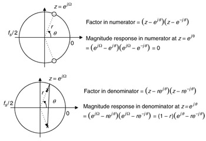
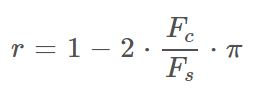
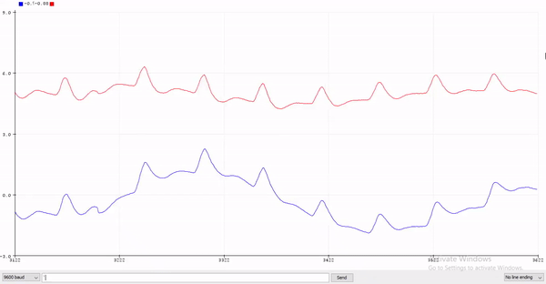
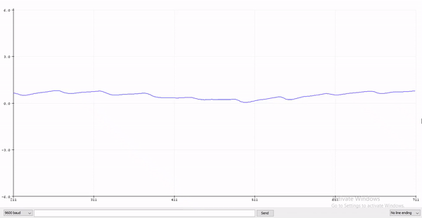
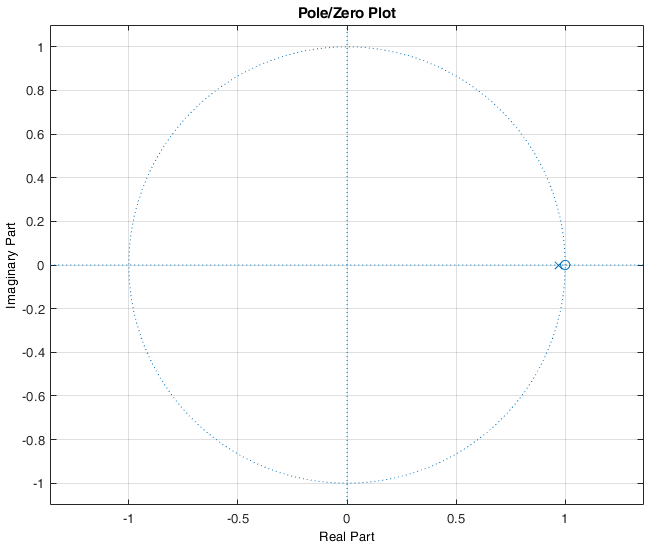
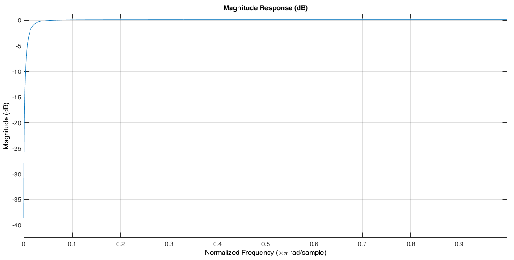
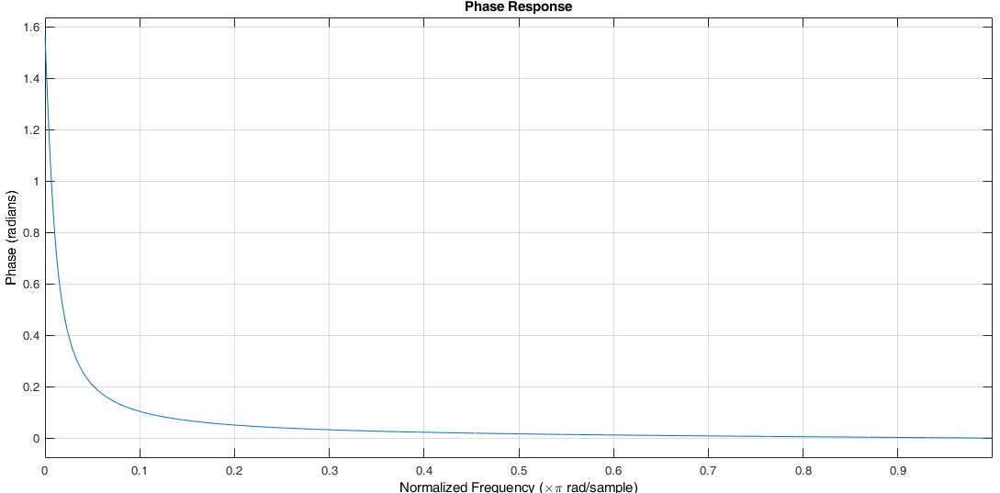

# **Digital Signal Processing Lab - 6**

<div style="text-align: right" font size= "4"> 9th March 2020 </div>

In this lab session we will design a high pass filter using the pole-zero placement method of filter design. We will use this filter to remove synthetic baseline components of frequency 0.1, 0.2 and 0.25 Hz from a PPG signal.

----
 ## **Pole Zero Placement Method**

It is a very simple method of approximate filter design where we decide the location of poles and zeros of the transfer function depending on the desired frequency response. We know the poles increase the magnitude response whereas the zeros reduce the magnitude response. So where we want less magnitude we place a zero and where we need higher magnitude we place a pole.



----
 ## **Procedure**

Here we will remove the frequency components upto 0.4 Hz so we need to go through the following steps

* Place a zero at z = 1 i.e a frequency equal to 0 Hz.
* Place a pole at frequency value of 0.4 Hz with *|z| = r* with *r* equal to


* The gain of the transfer function can be calculated by setting the magnitude of transfer function equal to 1 at frequency equal to F<sub>s</sub>/2
* Then the filter coefficients are calculated by taking the inverse Z-transfrom
* Thus the filter is known and we can use it to perform the analysis

***Code***
```cpp

float x[]={-0.875693857,-0.919727917,-0.953165283,-0.973946454, ..., -0.99913659,-1,-0.999465027,-0.985283842,}

int n = sizeof(x)/sizeof(float);

float err[n];
float RMSE;
float SNR;
float err_sq=0;
float x_sq=0;
void setup() {
  // put your setup code here, to run once:
  Serial.begin(9600);
}

void loop() {
  float y[n]={0};

  for(int i=0;i<n;i++)
  {
    x[i]+=0.1*sin(2*PI*(0.1/80)*i)+0.2*sin(2*PI*(0.2/80)*i)+0.15*sin(2*PI*(0.25/80)*i); //Synthetic Baseline component
  }
  //Initializing the arrays
  err_sq = 0;
  x_sq = 0;
  for(int i=3;i<n;i++){

    y[i]= 0.9384*y[i-1]+0.9843*x[i]-0.9843*x[i-1]; //The filter equation

    err[i] = y[i]-x[i];   //Error calculation
    err_sq += err[i]*err[i]; //
    x_sq += x[i]*x[i];
  }
  RMSE = sqrt(sum_e/sizeof(x)); //Root Mean Sqaure Error 
  SNR = 10*log(x_sq/sum_e);     //Sigal to Noise Ratio

  for(int i=0;i<n;i++)
  {
    Serial.print(x[i]);
    Serial.print(",");
    Serial.println(y[i]+5);
  }
}
```

----
 ## **Results**

<figure>
  
  <figcaption><b>Blue is the original PPG signal. Red is the signal recovered after passing through the said filter</b></figcaption>
</figure>

<figure>
  
  <figcaption><b>The Error Signal</b></figcaption>
</figure>

<br>

| Root Mean Sqaure Error (RMSE)|  Signal to Noise Ratio (SNR) in dB | 
| ----------- | ----------- | 
|        0.39 |    2.01   | 

----

## Filter Visualization using Matlab 

``` matlab
r = 0.9686;   %The calculated pole radius
zer = [1]';   %The loacation of zero
pol = [r*exp(-1i*pi/100)];   %The location of pole
[b,a] = zp2tf(zer,pol,1);
fvtool(b,a);
fvto
```







***Conclusions***

In this experiment we can clearly see that we can easily a design a approximate low pass, high pass, band pass filters using the pole zero placement method. It is one of the easiest methods to design a filter.

---- 